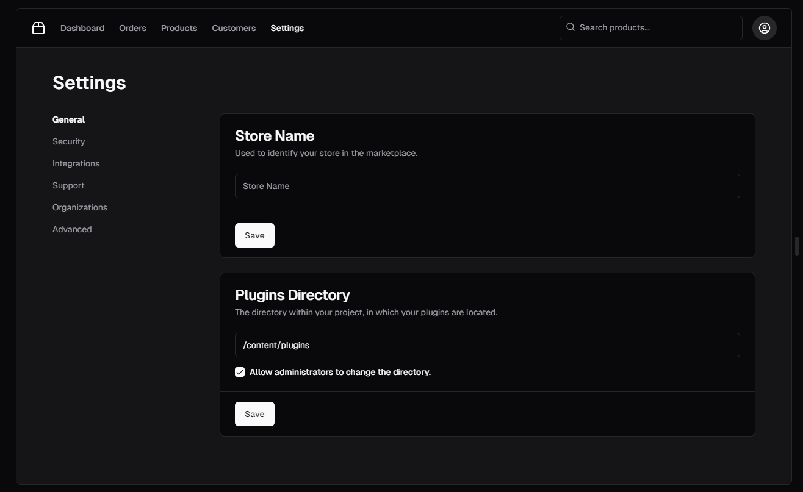

# Satisfactory-Gofer

Definition of Gofer: "An employee whose duties include running errands"

Ficsit would be proud

## Requirements

- Show a map of the current Satisfactory map
  - This shall include both used and unused resource nodes
    - Must be able to differentiate between the two
    - Shall be able to filter between pure, normal, and impure
  - This shall include hard drive locations
    - Must be able to differentiate between collected HDD and non-collected HDD
    - Should be able to hover over an HDD to see the requirements
  - Shall show all power slugs
    - Shall be removed from the map once collected
- Include a power planner
  - Details the resources required to build the power factory
  - Details the input resource requirement
  - Details the power required to jump start the factory
  - Details how much power will be generated
  - Details any byproduct
  - Details estimated time to fully stabilize
- Include a production planner
  - Have a way to note that you are bringing supplies from another factory into a current one
  - Detail the resources required the build the factory
  - Detail the input resource requirement
  - Detail the power required to run the factory
  - Detail how much product is produced
  - Detail any byproduct produced
- Include a way to save "factories" so that you can manage where supplies are going and how much you are producing
across the world

## Development Link Aids

Example for NavBar

